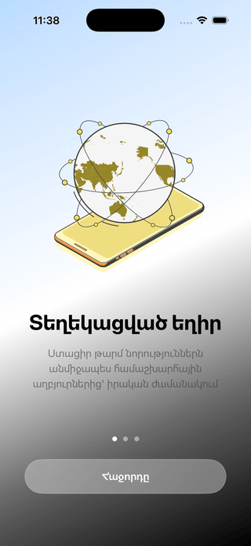

# Nova 
**Nova** is a high-performance, modern iOS news application designed for a seamless discovery experience. Built with a focus on deep engineering principles, clean architecture, and a premium user interface.

## 📱 App Preview (Armenian Version)
The preview above demonstrates the core user flow, including fluid Lottie animations, full Armenian localization, SwiftData-powered saving mechanism for offline reading and dark mode support.

  

## Tech Stack & Architecture
- **Language:** Swift 6.0
- **UI Framework:** SwiftUI
- **Architecture:** MVVM
- **Networking:** Native URLSession with Codable
- **Local Storage:** SwiftData 

## Key Features
- **News Feed:** Real-time news using NewsAPI 
- **Advanced Search:** Responsive search functionality
- **Offline Reading:** Save articles locally to read without internet
- **Localization:** Native support for Armenian and English languages
- **Adaptive UI:** Fully optimized for Dark Mode and Light Mode

## Project Structure
- `App/`: App Delegate and Root entry point.
- `Core/`: Networking, Utilities, and Extensions.
- `Features/`: Main app modules (Feed, Search, Saved).
- `Resources/`: Assets and Localizable strings.

## Setup
Since this project uses sensitive API keys, a `Secrets.plist` file is required in the `Resources` folder but is ignored by Git for security.
